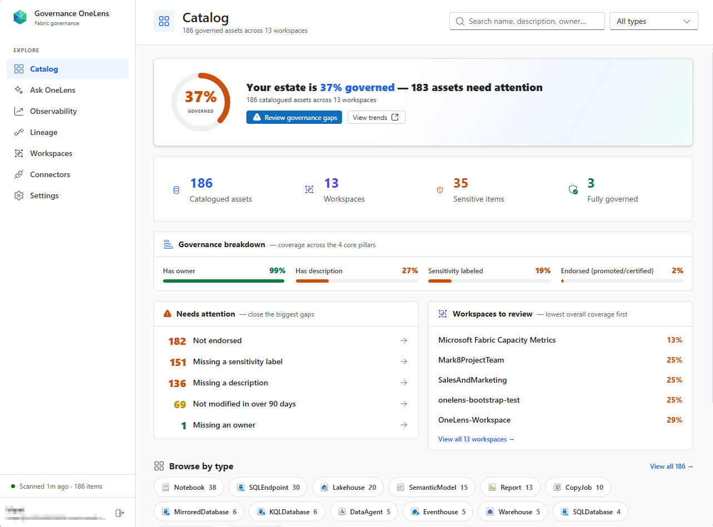

# Governance OneLens

**A Fabric-native governance catalog and observability app, built on [microsoft/rayfin](https://github.com/microsoft/rayfin) (Fabric Apps).**

[](LICENSE)
[](https://github.com/microsoft/rayfin)

Governance OneLens turns the governance data scattered across a Microsoft Fabric tenant —
workspaces, items, domains, lineage, sensitivity, endorsement, access — into a single
discoverable, continuously-scanned, and continuously-governed catalog. It auto-discovers the
entire tenant (no per-workspace install), scores governance posture across four lenses
(ownership, documentation, sensitivity, endorsement), and renders an interactive lineage graph
with impact analysis and sensitivity-risk detection — all served from a Rayfin-hosted app with
Fabric SSO and zero servers to operate.

Auto-discovered inventory across the whole tenant, a
governance score with one-click drill-through, and a worklist of what to fix first.



<!-- More screenshots / a short demo clip go here as they're added. -->

## Architecture at a glance

See [**ARCHITECTURE.md**](ARCHITECTURE.md) for a detailed six-stage architecture breakdown:
Sources → Ingestion → Transform → Storage → Hosting → Consumption, with data flow, security model,
and operational considerations.

## The problem

Data governance is **fragmented and often invisible**. As a Fabric estate sprawls across
workspaces and domains, teams can't easily answer basic questions: *What data do we have?
Who owns it? Is it labeled? Where does it flow, and what breaks if it changes? Who can
actually see it?* Native tooling helps, but goes dark under network lockdown (e.g. Private
Link) because it depends on the interactive **Govern** tab rather than APIs — so the picture
that matters most (audit time, incident time) is often the one that's missing.

## Who it's for

- **Data governance leads / stewards** who need one place to see coverage (ownership,
  documentation, sensitivity, endorsement) across the whole tenant, and a worklist to close
  the gaps — not a spreadsheet stitched together from five admin APIs.
- **Fabric platform / security admins** who need to prove posture for an audit, understand
  lineage and blast radius before a change, and do it from APIs that keep working under
  Private Link.
- **Anyone who "just needs to find the right data"** — search, rich asset profiles, and a
  lineage graph that shows exactly what's upstream and downstream of an asset, in plain terms.

## What we built

| Area | What it does |
| --- | --- |
| **Catalog & search** | Tenant-wide, auto-discovered inventory of every Fabric item, with rich asset profiles, deep-links back into Fabric, and CSV export (formula-injection safe). |
| **Observability (four lenses)** | A governance score plus coverage breakdown across **ownership, documentation, sensitivity labeling, and endorsement** — with a "needs attention" worklist that drills straight into the offending items. |
| **Lineage Explorer** | A workspace-first, interactive lineage graph (React Flow) with impact analysis (upstream/downstream blast radius), **sensitivity-risk detection** (flags items downstream of a labeled source that are themselves unlabeled, with a plain-English explanation of *why*), and real movement lineage captured from CopyJob/DataPipeline/Eventstream/Reflex/Ontology definitions. |
| **Access & RBAC** | Role assignments (direct + inherited) surfaced per item, the raw material for effective-access and oversharing analysis. |
| **Ask OneLens** | Natural-language Q&A over the governance catalog via a Fabric Data Agent, grounded on a dedicated DirectQuery semantic model — no Azure AI Foundry resources required. |
| **Connectors gallery** | A data-driven registry of collection sources (Fabric live today; Databricks/Purview/Informatica sketched as drop-in connectors) so new sources are additive, not a rewrite. |
| **Settings & ops** | A visibility console into the scanner's own health — last run, items written, connector status — plus a manual "run scan now" request queue. |

## How it works

See the [architecture diagram above](#architecture-at-a-glance) for the full pipeline. In short:

- **One dedicated workspace** hosts the app (auth, database, static hosting) and the scanner.
  Everything else on the tenant is discovered via admin APIs — nothing is deployed
  per-workspace, and a newly created item shows up on the next scan with zero extra setup.
- **Collection is secretless** — the scanner authenticates via the Fabric token library
  (`notebookutils.credentials.getToken`), so there is no service-principal secret and no
  Key Vault dependency to operate or rotate.
- **The write path is a locked, idempotent direct-SQL `MERGE`**, gated by a tombstone
  watermark so deleted Fabric items don't linger as ghosts. The app itself only ever *reads*,
  through the Rayfin-generated GraphQL API, fail-closed to an explicit governance-reader
  allowlist enforced server-side by data policies — never a client-side filter.

## Getting started

```bash
cd app
npm install
npm run dev          # local dev server against a Rayfin backend
```

To deploy to Fabric:

```bash
cd app
npx rayfin up --workspace-id <fabric-workspace-id> --tenant <tenant-id>
npx rayfin up db apply --workspace-id <fabric-workspace-id> --tenant <tenant-id>   # after any data-model change
```

Standing up a **brand-new** Fabric workspace/lakehouse/scanner from scratch? See
[`scanner/bootstrap_workspace.py`](scanner/bootstrap_workspace.py) and
[`scanner/README.md`](scanner/README.md).

See [app/README.md](app/README.md) for the frontend project structure and scripts, and
[scanner/README.md](scanner/README.md) for the scanner, semantic model, and Data Agent
deployment contract.

## Repository structure

| Folder | Contents |
| --- | --- |
| [`app/`](app/) | The Rayfin (Fabric Apps) frontend — React + Vite + Fluent UI, the governance data model (`app/rayfin/data`), and all pages/services. |
| [`scanner/`](scanner/) | The Fabric-native collector: `sjd_governance_scan.py` (production Spark Job Definition), semantic-model/Data-Agent deployment scripts, a workspace bootstrapper, and a local diagnostic collector. |
| [`knowledge-base/`](knowledge-base/) | The living design record — problem, architecture, API surface, frontend design, phased delivery plan, connector SDK spec, and the [Rayfin builder feedback log](knowledge-base/11-rayfin-feedback.md). |
| [`docs/screenshots/`](docs/screenshots/) | Screenshots and the architecture diagram used in this README (`architecture-source.html` is the editable source). |

See [knowledge-base/README.md](knowledge-base/README.md) for the design-record index, and
[ARCHITECTURE.md](ARCHITECTURE.md) for the full problem statement, architecture, and
access-control model.

## Status

The connector registry, discovery catalog, four-lens observability, and lineage explorer with
impact analysis are built and deployed. See
[knowledge-base/09-phased-plan.md](knowledge-base/09-phased-plan.md) for exact phase status.

## Feedback on building with Rayfin

We kept a detailed, evidence-backed log of what worked and what didn't while building this on
Rayfin — see **[knowledge-base/11-rayfin-feedback.md](knowledge-base/11-rayfin-feedback.md)**.
Highlights:

- 🟢 **What worked well**: the canonical `source`-tagged data model + generated GraphQL API made
  a multi-connector governance schema feel natural; `rayfin up` is a smooth, idempotent
  one-command deploy; Fabric SSO worked out of the box; adding a new entity end-to-end (SQL
  table + typed GraphQL API) was genuinely a one-file change.
- 🔴 **Biggest blocker**: Rayfin Functions tooling only emits TypeScript, but the Fabric User
  Data Functions runtime only accepts Python — the two layers can't meet, so we kept a Spark
  Job Definition for scheduled collection instead of Functions.
- 🟠 Other friction: no batch/bulk upsert on the generated GraphQL API (single-record mutations
  only, so we used a locked direct-SQL `MERGE` for the scanner's write path instead), no
  server-side entity lifecycle hooks (onboarding a connector can register as data but can't
  *actuate* — provision a secret, trigger the first collection), and a few Fabric-platform
  adjacent gaps (sensitivity-label GUIDs need a separate Graph call to resolve to names; deep
  item-content APIs like `getDefinition` need workspace membership, not just tenant-admin read).

Full details, reproduction evidence, and "asks" for the Rayfin team are in the linked document.

## Contributing

Contributions are welcome — see [CONTRIBUTING.md](CONTRIBUTING.md) for the dev setup, CI gate,
and conventions. This project has adopted the
[Microsoft Open Source Code of Conduct](CODE_OF_CONDUCT.md). Found a security issue? See
[SECURITY.md](SECURITY.md) instead of opening a public issue.

## License

MIT — see [LICENSE](LICENSE).

