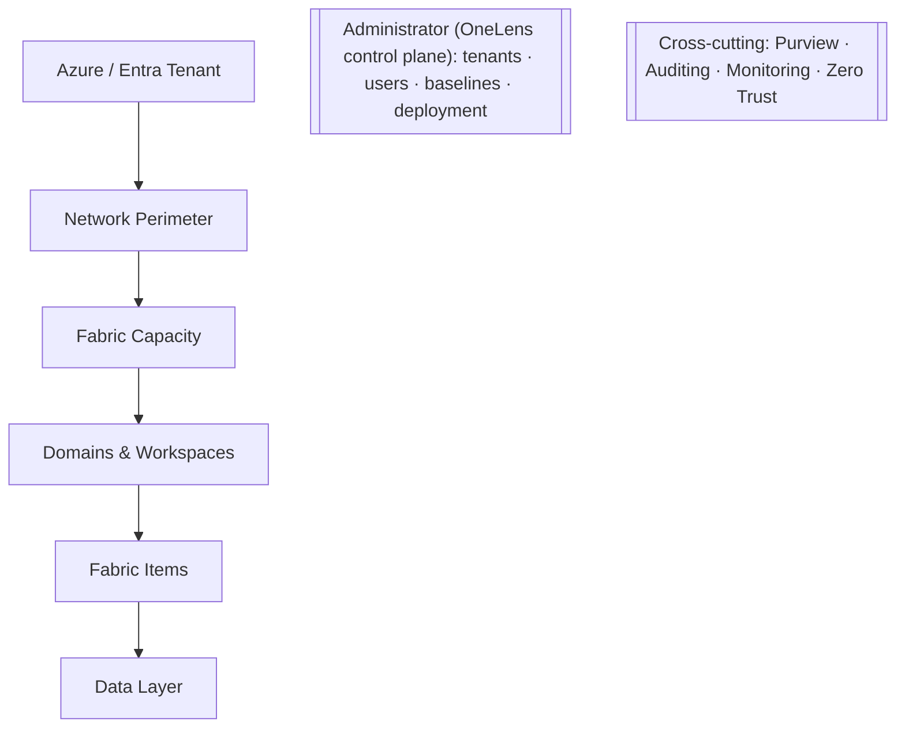
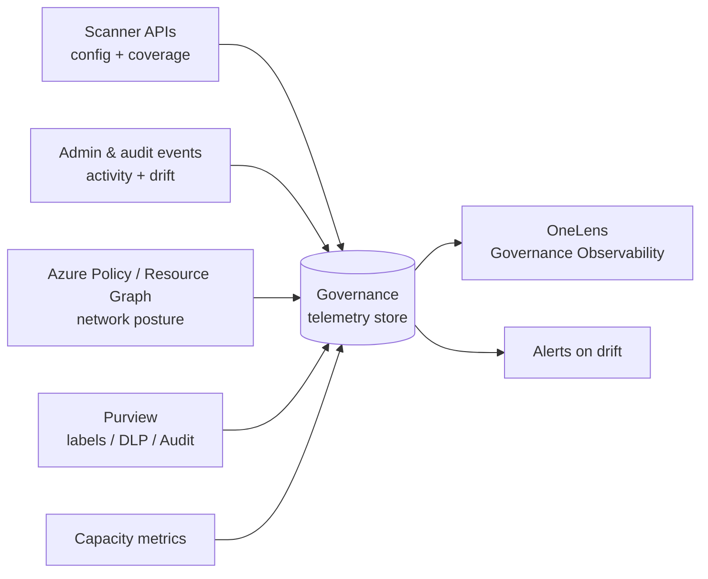
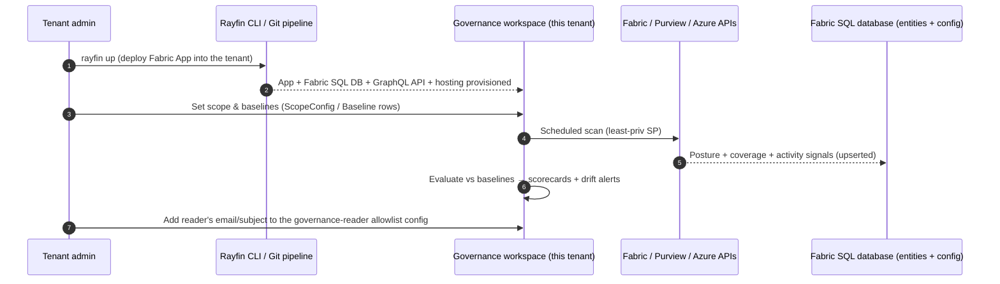

# Governance Observability Across Microsoft Fabric

> How to continuously monitor governance across **every layer** of Microsoft Fabric.
> This is the monitoring backbone for the Governance OneLens project.

## The core idea: one lens, applied to every layer

Governance monitoring is not a different activity per layer — it's the **same four
questions** asked at each layer of the Fabric stack:

| Lens | Question | Signal type |
| --- | --- | --- |
| **Posture** | Is it configured to standard *right now*? | Config state |
| **Coverage** | What **%** of assets in this layer meet the standard? | Aggregate metric |
| **Activity** | *Who* did *what*, *when*? | Event stream |
| **Drift** | What changed from the approved baseline (and alert)? | Change detection |

The pattern to remember: **Posture + Coverage** come from *config/scanner* APIs;
**Activity + Drift** come from the *audit/event* stream. Every layer decomposes into
those two pipes.

## The layers of Microsoft Fabric

> The **Administrator layer** is OneLens's own control plane. It wraps the Fabric layers
> above and is what makes the app **multi-user** and **multi-tenant deployable**. It is
> both a *monitored* layer (OneLens's own config and admin actions are audited) and the
> *operating* layer that onboards and scales OneLens across tenants.

## Governance monitoring matrix

| Layer | What you monitor | Primary signal source |
| --- | --- | --- |
| **Tenant / Entra** | Tenant setting values & changes; Conditional Access; delegated settings; label/DLP policy scope | Fabric Admin APIs, tenant settings, admin **activity events** / Purview Audit |
| **Network perimeter** | Private Link on/off; block-public-access; private-endpoint state | Azure Policy compliance, Azure Resource Graph, Activity Log |
| **Capacity** | Capacity assignment; workload/isolation config; throttling; data residency; consumption | Capacity Metrics app, capacity APIs, workspace monitoring |
| **Domains & Workspaces** | Domain→workspace mapping; workspace roles (Admin/Member/Contributor/Viewer); orphaned/over-permissive access; Git/CI state | Metadata **scanner APIs**, workspace/role REST APIs |
| **Items** | Sensitivity-label coverage; endorsement/certification; tags; item permissions; lineage completeness; Data Agent grounding | Scanner APIs, Catalog Search API, lineage APIs |
| **Data** | OneLake security roles (OLS/RLS/CLS); encryption; classification coverage; shortcut security | OneLake security APIs, scanner classification metadata |
| **Administrator (OneLens)** | Onboarded tenants & their status; OneLens user/role assignments; per-tenant baselines & thresholds; deployment/version state; app-identity consent | OneLens admin store, Entra app/consent APIs, deployment pipeline |
| **Cross-cutting** | All access/audit events; label & DLP hits; posture trend | Purview Audit, Purview Information Protection/DLP, Azure Monitor / Sentinel |

## The telemetry backbone

**Implementation:** scanners land signals as **governance entities in the Fabric SQL
database** (the OneLens app store), served via the **GraphQL API** to the app; drift alerts
fire via **Data Activator** *(Fabric User Data Functions once Rayfin Functions supports Python —
see [11 - Rayfin feedback](11-rayfin-feedback.md))*. Optionally, high-volume
time-series can also flow to an **Eventhouse/KQL** store for analytics (Fabric **workspace
monitoring** and the **admin monitoring workspace** provide part of this). See
[06 - Reference Architecture](06-rayfin-architecture.md).

## Signal-to-source matrix

A companion view: each governance signal, the lens it serves, and where it comes from.

| Signal | Lens | Layer | Source |
| --- | --- | --- | --- |
| Tenant setting change (who/when) | Activity, Drift | Tenant | Admin activity events / Purview Audit |
| Private Link / public-access state | Posture | Network | Azure Policy, Resource Graph |
| Capacity throttling & consumption | Posture, Coverage | Capacity | Capacity Metrics app |
| Workspace role assignments | Posture, Coverage | Workspaces | Scanner APIs, role REST APIs |
| Over-permissive / orphaned access | Drift | Workspaces | Scanner APIs + audit correlation |
| Sensitivity-label coverage % | Coverage | Items | Scanner APIs |
| Endorsement / certification status | Coverage | Items | Scanner APIs, Catalog Search API |
| Lineage completeness | Coverage | Items | Lineage APIs |
| OneLake security role coverage | Posture, Coverage | Data | OneLake security APIs |
| Classification coverage % | Coverage | Data | Scanner classification metadata |
| DLP detections | Activity | Cross-cutting | Purview DLP |
| Access events (who accessed what) | Activity | Cross-cutting | Purview Audit |

## Administrator layer — single-tenant deployment

Governance OneLens is deployed **into each customer's own tenant** as a self-contained Fabric
workspace (Commercial, single-tenant-per-deploy). There is **no shared control plane and
no cross-tenant isolation problem** — each install is its own boundary. The Administrator
layer covers how one deployment is configured, governed, and stood up.

### 1. Identity (in-tenant)
- The app is built on **[microsoft/rayfin](https://github.com/microsoft/rayfin)** (Fabric
  Apps) and uses **Fabric SSO (Entra)** — users sign in with their own Fabric identity, and
  **read access is gated by a fail-closed governance-reader allowlist** on the entity model —
  every allowlisted reader sees the whole tenant catalog (no per-row trimming). No custom auth.
  See [ARCHITECTURE.md § Security & Governance](../ARCHITECTURE.md#security--governance) for the full model.
- Background scanners run under a **least-privilege service principal** scoped to read the
  governance signals.
- Skills: `entra-app-registration` / `azure-rbac` (for the scan service principal only).

### 2. OneLens roles (via native Fabric)
**Real, verified access model (see [ARCHITECTURE.md § Security & Governance](../ARCHITECTURE.md#security--governance)):** there is no distinct Steward/Viewer permission tier
today — every entity's read access is gated by the **same fail-closed governance-reader
allowlist**. Any allowlisted reader sees the *whole* tenant catalog.

| Capability | Delivered via | Can do |
| --- | --- | --- |
| **Fabric workspace admin** | Native Fabric workspace **Admin** role | Redeploy/reconfigure the app, manage the underlying workspace (a Fabric platform permission, separate from the app) |
| **Governance reader** | App access via the governance-reader allowlist | Read governance observability dashboards, review posture/coverage, action drift, curate metadata — the same access for every allowlisted reader |

> The **Admin / Steward / Viewer** RACI roles below describe an organizational
> accountability model (who *should* act on what), not distinct technical permission tiers —
> the app itself does not yet enforce different access levels between them.

### 3. Configuration as data
- Scope (in-scope domains/workspaces), governance **baselines**, drift **thresholds**, and
  alert routing live as **`ScopeConfig` / `Baseline` entities in the Fabric SQL database** —
  editable data, not redeployed infra.
- Any unavoidable secret goes in **Key Vault referenced via a Fabric connection**; prefer
  the workspace identity so secrets are rarely needed.

### 4. Repeatable deployment (Fabric-native)
- Ship Governance OneLens as a **versioned Fabric workspace** using **Git integration** and
  **deployment pipelines** (Dev/Test/Prod) — no `azd`/Bicep/containers.
- An **install runbook** stands the solution up in a new tenant and points it at scope.

### Deployment & onboarding sequence

**Install checklist:**

1. **Deploy** Governance OneLens with `rayfin up` (provisions the Fabric SQL DB, GraphQL API, and hosting).
2. **Provision** the scan service principal / workspace identity (least privilege, admin read scopes).
3. **Set scope** and seed baselines as `ScopeConfig` / `Baseline` entities.
4. **Schedule** the scanner pipeline; run the first scan.
5. **Arm alerts** with Data Activator.
6. **Grant access** by adding each reader's email/subject to the governance-reader allowlist config; sign-in is **Fabric SSO** only.

> **Design rule:** each deployment is **one self-contained Fabric workspace in the
> customer's tenant** — no shared infrastructure, minimal external dependencies.

## Stewardship operating model (RACI)

Governance only works if **accountability is explicit**. The activities below map to a simple
organizational RACI — this describes *process* accountability, not technical permission tiers:
every allowlisted reader currently has the same read access in the app (see
[ARCHITECTURE.md § Security & Governance](../ARCHITECTURE.md#security--governance)). **R** = Responsible, **A** = Accountable, **C** = Consulted,
**I** = Informed.

| Activity | Admin | Steward | Data owner / producer | Viewer / consumer |
| --- | --- | --- | --- | --- |
| Define baselines & thresholds | A/R | C | C | I |
| Apply / curate sensitivity labels | C | R | A | I |
| Certify / endorse items | I | R | A | I |
| Review posture & coverage | A | R | C | I |
| Action drift alerts | A | R | C | I |
| Approve access / role changes | A/R | C | C | I |
| Maintain lineage accuracy (naming, connections) | C | R | A | I |
| Consume only trusted data | I | I | I | R |

- **Data owner / producer** is accountable for *their* domain's labels, certification, and
  lineage; the **Steward** operationalizes and reviews across domains.
- **Admin** owns platform-wide baselines and access decisions.
- OneLens's value: it makes the RACI **observable** — surfacing each activity's status so the
  accountable role can act, with drift alerts routed to the responsible party.

## What OneLens surfaces

A **Governance Observability** view with one scorecard per layer:

- **Posture score** — green/amber/red per layer
- **Coverage %** — e.g. "94% of items labeled", "88% of sensitive tables under OneLake security"
- **Recent activity** — top governance-relevant events
- **Drift feed** — baseline deviations with who/when + alert

Because it is assembled from scanner + audit + policy signals (not the native Govern tab),
it keeps working even when Private Link locks the native experience down.

## Compliance frameworks are an optional overlay

FedRAMP, ISO 27001, HIPAA, and SOC 2 are each just a **mapping** from these per-layer
signals to a control set. Build the observability layer once; attach control mappings as
views on top when a workload requires them.

---

---
