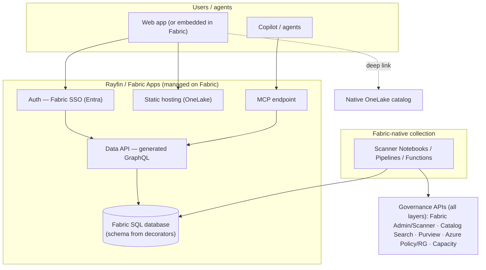
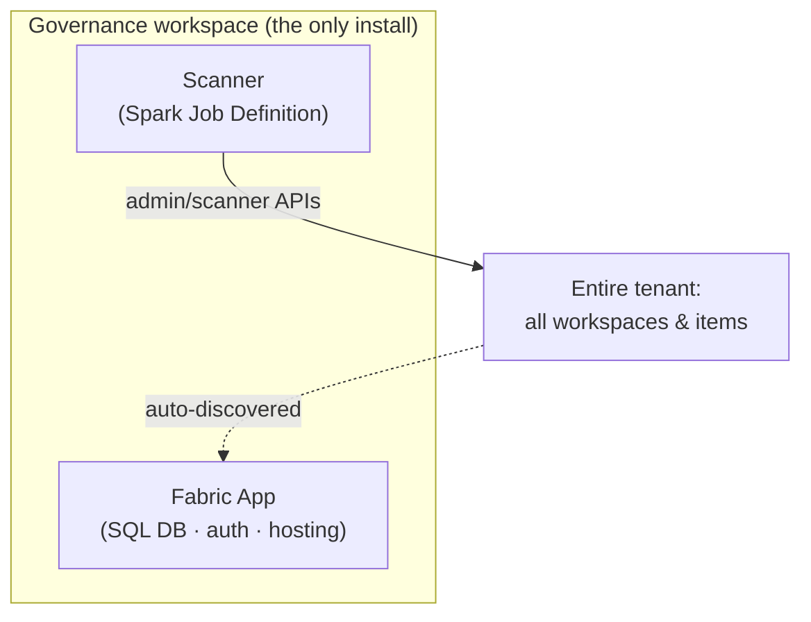
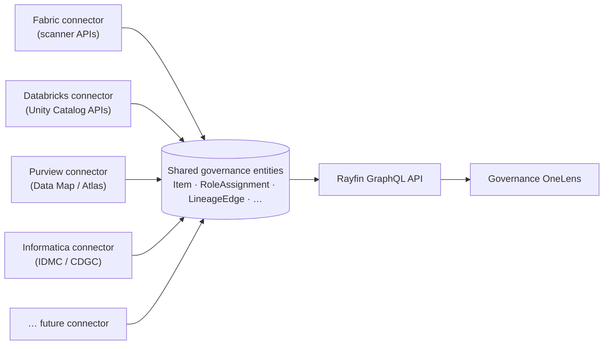

# Governance OneLens — Reference Architecture

> The technical blueprint for **Governance OneLens** — built on
> **[microsoft/rayfin](https://github.com/microsoft/rayfin)**, a Backend-as-a-Service
> (auth, data APIs, storage, hosting) **built on Microsoft Fabric**. The app is the
> front-facing layer for all the rich governance data we collect across everything touching
> Fabric. Grounded in the governance foundation ([05](05-governance-observability.md)).
>
> **Naming:** *Rayfin* = the microsoft/rayfin **BaaS platform**. *Governance OneLens*
> (*OneLens*) = this project — the governance app, built on Rayfin.
>
> **Status:** Rayfin ships as **Fabric Apps (preview)**. Prereqs: a workspace with **Fabric
> capacity**, the tenant admin enabling the **Fabric Apps** workload, and a supported region.

## Design principles

1. **Front-facing on Rayfin BaaS** — the app's **auth, data APIs, storage, and hosting** are
   provided by [microsoft/rayfin](https://github.com/microsoft/rayfin). We define the data
   model with **TypeScript decorators**; Rayfin provisions and manages the backend. No
   containers, custom API, or servers to operate.
2. **Rayfin is built on Fabric** — the app **inherits Fabric's governance, security, and
   access control** out of the box, so our governance app is itself governed.
3. **Fabric-native data collection** — a scanner (today a **Fabric Spark Job Definition**
   running the Python connector) calls the governance APIs ([07](07-api-surface.md)) and
   populates the Rayfin data model. *(Rayfin **Functions** was the target serverless engine
   but is currently blocked — see [11 - Rayfin feedback](11-rayfin-feedback.md).)*
4. **Observability first** — posture / coverage / activity / drift for every Fabric layer
   (see [05 - Governance Observability](05-governance-observability.md)).
5. **Showcase ease of use** — `npm create @microsoft/rayfin` → define entities → `npx rayfin up`.
   Minimal infra, fast to ship.
6. **Single-tenant-per-deploy (Commercial)** — one OneLens deployment per customer tenant; **Fabric
   brokered auth** means users sign in with their own Fabric identity.

## Component architecture

The **Governance OneLens app is a Rayfin app**. Rayfin provides the front-facing backend (auth,
data APIs, storage, hosting); Fabric-native scanners feed it governance data.



### Rayfin packages used

| Package | Role in Governance OneLens |
| --- | --- |
| `@microsoft/create-rayfin` | Scaffold the project (`npm create @microsoft/rayfin`) |
| `@microsoft/rayfin-core` | Define governance **entities** with TypeScript decorators |
| `@microsoft/rayfin-cli` | Deploy & manage (`npx rayfin up`) |
| `@microsoft/rayfin-client` | Front-end client SDK |
| `@microsoft/rayfin-data` | Typed access to the generated **GraphQL** data API |
| `@microsoft/rayfin-auth` + `-auth-provider-fabric` | **Fabric SSO (Entra)** — sign in with Fabric identity |
| `@microsoft/rayfin-functions` | Server-side logic (**Fabric User Data Functions**) / scan orchestration |
| `@microsoft/rayfin-storage` | Files/artifacts (e.g., exports) |
| `@microsoft/fabric-embedded-host` | Embed the app **inside Fabric** (iframe/PostMessage) — not yet installed |
| `@microsoft/rayfin-mcp` | **(corrected 2026-07-09.)** Installed as a devDependency + wired via `.mcp.json`. Verified it is a **developer-documentation MCP server** (wraps `@microsoft/rayfin-docs`, exposes `search_docs`/`get_doc`/`list_docs`/`discover_packages` to coding agents) — it does **not** expose the app's own governance data to an end-user agent. "Ask OneLens" (NL Q&A over `Item`/`LineageEdge`/etc.) is a **separate, not-yet-built** capability — see [knowledge-base/11-rayfin-feedback.md](11-rayfin-feedback.md). |

### Data model as code

Define governance entities once with `@microsoft/rayfin-core` decorators (`@entity`,
`@uuid`, `@text`, `@boolean`, `@date`, `@authenticated`); Rayfin generates the **Fabric SQL
database schema** and the **GraphQL API** automatically. Representative
entities (each carries a **`source`** field for multi-platform support):

- `Workspace`, `Domain`, `Item`, `RoleAssignment`, `SensitivityLabel`, `Tag`
- `LineageEdge` (source→target), `PostureSnapshot`, `CoverageMetric`, `ActivityEvent`, `DriftEvent`
- `Baseline`, `Threshold`, `ScopeConfig` (governance config)

**Real, verified access model (corrected — see [ARCHITECTURE.md § Security & Governance](../ARCHITECTURE.md#security--governance)):**
each entity's `@authenticated('read', { policy })` calls the same fail-closed
**governance-reader allowlist** — an explicitly configured set of reader emails/subjects.
Any allowlisted reader sees the *whole* tenant catalog; there is no per-row/per-user
trimming based on the viewer's own Fabric permissions. (An earlier draft of this doc
described a per-row `@role`-based trimming model that was never actually built this way —
see [11 - Rayfin feedback](11-rayfin-feedback.md) finding #12 for the verified history.)

## Component responsibilities

| Component | Responsibility |
| --- | --- |
| **OneLens app (front)** | The governance UI — catalog discovery, per-layer scorecards, lineage/impact, drift feed. Auth, data APIs, and hosting provided by Rayfin. |
| **Scanner Notebooks / Pipelines / Functions** | Call the governance REST APIs ([07](07-api-surface.md)) and write governance **entities** into the Rayfin data store. Run under a least-privilege service principal. |
| **Governance data store + Data APIs** | Rayfin-managed (Fabric-backed) database exposing type-safe endpoints over the governance entities. |
| **Fabric brokered auth** | Users sign in with their Fabric identity; Fabric governance/access control applies. |
| **MCP endpoint** | Lets Copilot/agents query governance data in natural language, trimmed to the caller. |
| **Native OneLake catalog** | Primary browse surface; the app enriches and deep-links to it. |
| **Power BI / analytics (optional)** | Complementary dashboards via `fabric-apps-analytic-templates` over the same data. |

## Deploying the app (ease of use)

```bash
npm create @microsoft/rayfin@latest   # scaffold: data models, auth, APIs, app
# define governance entities with decorators (@microsoft/rayfin-core)
npx rayfin up                          # provision backend + deploy the app
```

One command scaffolds; one command deploys. Rayfin provisions the database, auth, data
APIs, storage, and hosting — so a new tenant install is minutes, not infrastructure work.

> Skills for the **collection** side: `spark-authoring` (scanner notebooks),
> `search-consumption` / `sqldw-consumption`, `activator-authoring`, plus
> `entra-app-registration` / `azure-rbac` for the scan service principal.

## Deployment & discovery model

> **Build status (2026-07).** The collection **engine** is a **Fabric Spark Job Definition** running
> the Python connector; the **write path is locked to direct-SQL bulk MERGE**. Rayfin **Functions**
> (Fabric User Data Functions) — the intended serverless engine — is **blocked today**: the Rayfin
> tooling emits TypeScript while the UDF backend accepts Python only (see
> [11 - Rayfin feedback](11-rayfin-feedback.md)). The **connector registry + Connectors gallery are
> shipped** — a source is registered as a **`Connector`** row and rendered in-app — so the engine can
> be swapped later without touching connectors or schema.

**One dedicated governance workspace = the entire install boundary.** It holds the Fabric
App (which auto-creates its child **SQL database**, **auth**, and **static hosting**) plus
the **scanner** Notebooks / Pipelines / Functions. **Nothing is deployed into any other
workspace.**

**Everything else is auto-discovered.** The scanner's service principal calls **tenant-level
admin/scanner APIs** that enumerate **all** workspaces, items, roles, and settings across
the tenant — so new workspaces/items are picked up automatically on the next scheduled or
`modifiedWorkspaces` incremental scan. No per-workspace agent, no manual registration.



**The one requirement:** tenant-wide discovery needs the SP granted **admin read scopes**
(Fabric Administrator / `Tenant.Read.All` + the *"service principals can call admin APIs"*
tenant setting), plus **Azure Reader** and **Microsoft Graph** scopes for the network and
identity layers. Without admin rights, the SP sees only what it's explicitly a member of.
Discovery can be **narrowed** via `ScopeConfig` (e.g., specific domains) when whole-tenant
scope isn't wanted.

## Key data flows

**Collection (scheduled):**
`Scanner (SP) → governance REST APIs → direct-SQL bulk MERGE (upsert) into the Fabric SQL database` *(locked
write path — idempotent upsert on canonical `id`; app/user writes go via the GraphQL API)*

**Serving (user):**
`User → OneLens app → Fabric SSO → GraphQL API → entities (allowlist-gated, tenant-wide) → UI`

**Agents (NL Q&A):**
`Copilot / agent → Rayfin MCP → GraphQL API → governance answer (trimmed)`

**Drift:**
`Scanner writes DriftEvent → app drift feed + alert (Data Activator; Fabric User Data Function once Rayfin Functions supports Python — see [11](11-rayfin-feedback.md))`

## Governance intelligence & lineage

### Lineage tracking
OneLens treats **lineage as a first-class governance signal**, not an afterthought:

- **Capture** — pull the lineage graph from the **scanner API** (datasource → item →
  downstream report) and, where available, **Purview Data Map** for org-wide, cross-source
  lineage that reaches beyond Fabric.
- **Model** — store lineage as **source→target `LineageEdge` entities** in the Fabric SQL
  database (item type, workspace, last-seen) so it can be queried, versioned, and diffed.
- **Surface** — show **upstream/downstream** for any item and run **impact analysis**
  ("what breaks if I change this?") in the app, with deep-links to each item.
- **Govern with it** — answer compliance/audit questions (where did this report's data come
  from?), detect **orphaned/obsolete** assets, and enable **change management** before a
  breaking change ships.
- **Coverage lens** — track **lineage completeness %** (items with known upstream/
  downstream) as a governance metric; low coverage is itself a finding.

### Data intelligence — natural-language governance Q&A
Because the governance estate lands as entities in the Fabric SQL database (served via
GraphQL), OneLens can put a **natural-language layer** over it:

- **Copilot / Fabric Data Agent over the OneLens semantic model** — ask "which sensitive
  tables aren't covered by OneLake security?" or "what changed in the Finance domain this
  week?" in plain language.
- **Grounded + trimmed** — answers are grounded in the governed Fabric SQL entities and
  respect the same **fail-closed governance-reader allowlist** as every other read — only an
  allowlisted user can ask, and they see the whole tenant catalog's worth of answer, same as the UI.
- **Governed AI (dogfooding)** — apply the same AI-governance guardrails OneLens monitors
  (label-aware grounding, prompt/response audit) to OneLens's own assistant.

## Open source & extensibility

**Open-source posture.** Rayfin and its templates are **MIT-licensed** open source
(`microsoft/rayfin`, `microsoft/awesome-rayfin`). We lean into that:
- **Start from an open template** (`npm create @microsoft/rayfin -- --template …`) instead of bespoke scaffolding.
- **Publish Governance OneLens as a reusable template** (a candidate for `awesome-rayfin`) and keep connectors open source.
- Prefer **open standards** (GraphQL, Delta/Iceberg, open lineage) so the model isn't locked to one platform.

**Pluggable connectors (future data sources).** The entity model is **source-agnostic** —
every entity carries a `source` (e.g., `fabric`, `databricks`, `purview`, `informatica`, `snowflake`).
Each platform is a **connector** that maps its governance metadata into the shared entities.



| Connector | Source of governance metadata |
| --- | --- |
| **Fabric** (built-in) | Admin/Scanner APIs, Catalog Search, OneLake security, lineage |
| **Databricks** | Unity Catalog (catalogs/schemas/tables, grants, system-table lineage) |
| **Purview** | Data Map (Atlas): assets, classifications, lineage, glossary |
| **Informatica** | IDMC / CDGC: cataloged assets, glossary, classifications, cross-platform lineage |
| **Snowflake / others** | `ACCOUNT_USAGE`, grants, object lineage (community-contributable) |

> A connector implements one contract: *read the source's governance metadata → upsert the
> shared entities*. New sources are **additive** — no schema change, no app change — turning
> OneLens into a **cross-platform governance catalog**, aligned with the data-mesh /
> unified-catalog direction described in industry governance frameworks (DAMA-DMBOK2, EDM Council DCAM/CDMC).
> See [10 - Connector SDK](10-connector-sdk.md) for the Databricks and Informatica onboarding walkthroughs.

### Grounded in industry standards

Governance frameworks converge on the same primitives — **assets, ownership, classification,
policy, lineage, quality** — which is exactly our **canonical entity model**. Aligning to
standards is what lets connectors interoperate without bespoke glue:

| Standard / framework | Role here |
| --- | --- |
| **DAMA-DMBOK2** | Reference body of knowledge (governance, metadata, quality, security) |
| **EDM Council DCAM / CDMC** | Capability model + cloud data-management controls (sensitive data) |
| **ISO/IEC 38505** | Governance of data (accountability + value) |
| **ISO/IEC 11179** | Metadata registry model — basis for a canonical metamodel |
| **ISO 8000 / 27001 / 27701** | Data quality / security / privacy |
| **OpenLineage** | Open standard for lineage events (connector output) |
| **Egeria / Apache Atlas / OpenMetadata** | Open metadata + **connector frameworks** we mirror |
| **W3C DCAT / ODCS** | Interoperable catalog vocabulary + data contracts |

### The connector contract (true plug-in, zero reconfiguration)

A connector is a package that implements **one stable interface** and maps a source's
metadata into the **canonical entities**. Nothing else changes.

```typescript
interface GovernanceConnector {
  id: string;                 // e.g., "databricks"
  source: string;             // stamped on every entity it emits
  capabilities: Capability[]; // e.g., ["items","roles","lineage","classifications"]
  authenticate(config): Promise<Session>;
  discover(session, cursor?): AsyncIterable<CanonicalEntity>; // Item / RoleAssignment / LineageEdge / …
}
```

**Why no reconfiguration is needed:**
- **Canonical, `source`-tagged model** — a new source adds *data*, never schema.
- **Self-registration** — a connector's config is a `Connector` row (endpoint, credential
  reference, schedule) added from **Settings** as data; the scanner scheduler picks it up.
- **Capability negotiation** — the connector declares what it supports; the UI is
  **data-driven** and renders whatever sources/lenses exist (new `source` badges/filters
  appear automatically).
- **Standard formats** — emit **OpenLineage** for lineage and **DCAT**-style catalog
  metadata so connectors interoperate.

> **Net:** drop in the package + add one config row = a new source live. No app change, no
> schema change, no redeploy.

## Skills architecture

The connector contract above generalizes into a **skills model**: OneLens is a **skill host**
plus a growing library of self-describing **governance skills**. This mirrors the agent
"skills" pattern — a capability with a `description` (when it applies) and on-demand logic,
discovered and invoked by an orchestrator. It keeps the system **additive and manageable**:
every capability is one small, independently shippable, independently testable unit.

**One manifest, two kinds** (plus the Phase 0 `platform` layer):

```typescript
interface GovernanceSkill {
  id: string;                 // "fabric-inventory"
  kind: "platform" | "collection" | "analysis";
  capabilities: Capability[]; // items | lineage | roles | access | activity | posture | drift | quality | search …
  description: string;        // when this skill runs / when the agent picks it (the "trigger")
  // collection: authenticate(cfg) + discover(ctx): AsyncIterable<CanonicalEntity>
  // analysis:   answer(query, ctx): grounded result over the entities, gated by the same governance-reader allowlist
}
```

**Two runtimes invoke skills by description** (no monolithic dispatcher):
- **Scheduler** runs **`collection`** skills (the connectors) → emit canonical entities → the locked `upsert()` (direct-SQL `MERGE`).
- **"Ask OneLens" MCP agent** runs **`analysis`** skills (search, profile, scorecards, access, drift) → grounded answers, gated by the same governance-reader allowlist as every other read.
- **`platform`** skills (Phase 0) are the host itself: `entity-model`, `upsert-runner`, `skill-registry`, `mcp-host`, `auth-broker`.

**Layered, one-directional:** `platform` → `collection` fills entities → `analysis` reads them
→ app/agent surface. Each phase just **registers more skills**; the core never changes. A
skill's `capabilities[]` drive the UI (badges/filters/tabs appear automatically), and the
collection **engine** (Notebook / Pipeline / UDF / KQL / Spark) is hidden *inside* the skill —
so engine complexity never leaks to callers. Start simple (one scheduled Notebook) and adopt
heavier engines only when a concrete latency/scale need is triggered.

See the **per-phase skill map** in [09 - Phased Plan](09-phased-plan.md#skills-architecture--per-phase-skill-map).

## Build-order backlog

Phased so each stage ships value and de-risks the next.

### Phase 0 — Foundation (on Rayfin)
- [ ] `npm create @microsoft/rayfin` — scaffold app (auth, data APIs, hosting)
- [ ] Define governance **entities** with `@microsoft/rayfin-core` decorators
- [ ] Provision a least-privilege **scan service principal** (`azure-rbac`, `entra-app-registration`)
- [ ] `npx rayfin up` — deploy the baseline app

### Phase 1 — Discovery MVP
- [ ] Scanner: pull item metadata via Scanner API / Catalog Search → Rayfin entities
- [ ] App discovery page (label, domain, endorsement, tags, ownership) with deep-links
- [ ] Fabric brokered auth (`@microsoft/rayfin-auth-provider-fabric`)
- [ ] Lean on the native OneLake catalog as the primary browse surface

### Phase 2 — Governance observability
- [ ] Scanners for posture/coverage/activity per layer → Rayfin entities (`spark-authoring`)
- [ ] **Lineage capture** (scanner graph → `LineageEdge` entities) + lineage completeness %
- [ ] Per-layer scorecards in the app (+ optional Direct Lake / Power BI dashboards)
- [ ] Drift detection vs baselines + alerts (Rayfin Functions / Data Activator)
- [ ] Network/Azure Policy posture pull (works under Private Link)
- [ ] Trimming via Fabric brokered auth (users see only permitted scope)

### Phase 3 — Packaging & repeatable deploy
- [ ] One-command install per tenant (`npx rayfin up`) + optional Fabric embed (`fabric-embedded-host`)
- [ ] **Lineage & impact analysis surfacing** in the app (upstream/downstream + impact)
- [ ] Config-as-data: scope/baselines as `ScopeConfig` / `Baseline` entities
- [ ] Roles via Fabric brokered auth (Admin / Steward / Viewer)
- [ ] Install runbook + `awesome-rayfin` template

### Phase 4 — Intelligence & cross-source
- [ ] **Data intelligence:** natural-language governance Q&A via **Rayfin MCP** (Copilot/agents), trimmed
- [ ] **Cross-platform connectors** — **Databricks** (Unity Catalog), then **Informatica** (IDMC/CDGC) → shared entities
- [ ] Data quality / freshness / certification signals
- [ ] AI/agent governance (label flow to Copilot, prompt/response audit)
- [ ] Compliance overlays (map signals → control sets) as report views
- [ ] Data products & ABAC/tag-based policy views

### Phase 5 — Operate & sustain
- [ ] Scan **reliability** (retries, failed-scan alerts, freshness SLAs)
- [ ] **Schema migration** discipline (`rayfin up db apply`, versioned entity changes)
- [ ] **Capacity/cost** monitoring of scans + app
- [ ] Connector **upkeep** as source APIs evolve
- [ ] **App-health** view (scan status, freshness, last run) for admins

## Decisions

**Locked:**
- **Front-facing platform** — built on **[microsoft/rayfin](https://github.com/microsoft/rayfin)** (ships as **Fabric Apps, preview**): a managed Fabric service providing Fabric SSO auth, a generated **GraphQL** data API, a **Fabric SQL database**, and static hosting.
- **Cloud & tenant model** — Commercial, **single-tenant-per-deploy** (one Fabric app per tenant).
- **Data model as code** — governance entities via **TypeScript decorators**; schema + GraphQL API generated automatically; read access gated by a fail-closed governance-reader allowlist.
- **Access model** — **Fabric SSO (Entra)** only in production; a fail-closed **governance-reader allowlist** (not per-row trimming). No custom auth.
- **Collection** — Fabric-native scanners populate entities; server logic via **Fabric User Data Functions**.
- **Scanner write path (LOCKED, Phase 0 — VERIFIED)** — the scanner / connector-runner persists via **direct-SQL bulk `MERGE`** into the generated Fabric SQL database (idempotent **upsert keyed on the canonical `id`**), behind a thin, swappable `upsert()` helper; **app/user-initiated writes use the generated GraphQL API**. Chosen over per-entity **GraphQL mutations** (too chatty / throttled at full-tenant scale) and **Fabric User Data Functions** (extra hop + cold-start; better for transactional server logic). Safe because the allowlist policy is enforced at **read** time — never by restricting the scan — so connectors stay decoupled from the write mechanism (they only emit canonical entities). **Concrete mechanism (verified 2026-07):** the deployed app's **SQL Database child item** exposes a connection string (via the Fabric Items API / portal); a scanner holding an Entra token (audience `https://database.windows.net/`, granted write on the DB) runs `MERGE` DML against `dbo.<Entity>` tables. **Schema stays code-managed** — only `rayfin up` applies DDL; scanners never alter schema.
- **Open & extensible** — MIT open source; **pluggable connectors** (Fabric, Databricks, Purview, …) feed a shared, `source`-tagged entity model.

**Prerequisites & caveats:**
- **Fabric Apps is in preview** — workspace needs **Fabric capacity**, tenant admin must enable the **Fabric Apps** workload, and it's region-limited.
- **Static content is served at a public URL** (Fabric SSO gates the app) — keep secrets out of frontend/code.
- **Not for complex multi-step transactions.** The scanner → SQL DB **write path is locked to direct-SQL bulk `MERGE`** (see *Locked* decisions above); app/user writes use the GraphQL API.

---

*See also: [05 - Governance Observability](05-governance-observability.md) for the
monitoring model this architecture implements.*
