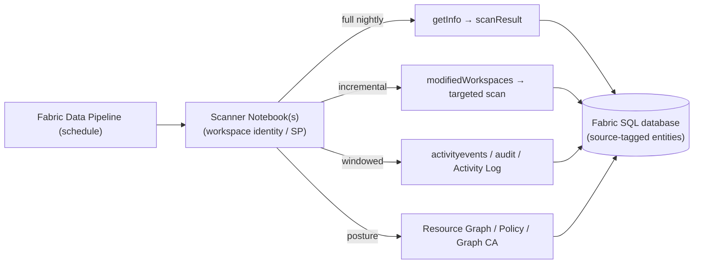

# Data Governance API Surface

> Governance OneLens is **API-first**: a least-privilege service principal (granted the read scopes
> below) drives scanner Notebooks that pull rich governance data across every layer of the
> top-down Fabric model. This doc catalogs the APIs to call, the rich data each returns,
> and which of the four lenses (posture / coverage / activity / drift) it feeds.
>
> **Accuracy note:** endpoints below are representative. Exact routes, versions, and
> preview/GA status evolve — validate against current docs (`learn.microsoft.com/rest/api/fabric`,
> `/rest/api/power-bi/admin`, Microsoft Graph, ARM, Purview) before implementing.

## Auth & permissions by API family

| API family | Identity / scope (read) |
| --- | --- |
| **Fabric Core REST** | SP with Fabric access; workspace/item read |
| **Fabric/Power BI Admin REST** (scanner, tenant settings, domains, activity) | SP with **Fabric Administrator** or **Tenant.Read.All** admin scopes; "service principals can call admin APIs" tenant setting enabled |
| **OneLake Data Access Roles** | SP with item read on the Lakehouse/warehouse |
| **Microsoft Graph** (Conditional Access, audit, labels, directory) | SP with `Policy.Read.All`, `AuditLog.Read.All`, `InformationProtectionPolicy.Read.All`, `Directory.Read.All` |
| **Azure Resource Graph / Policy / Activity Log** | SP with **Reader** on target subscriptions/mgmt groups |
| **Purview Data Map (Atlas)** | SP with **Data Reader/Curator** on the Purview account |
| **Purview / Microsoft 365 Audit** | SP with audit-log read (Office 365 Management Activity API subscription) |

## Layer 1 — Tenant / Entra

| API | Rich data | Lens | Type |
| --- | --- | --- | --- |
| `GET /v1/admin/tenantsettings` (Fabric admin) | All tenant setting values + delegation state | Posture | Batch |
| `GET /admin/activityevents` (Power BI admin) | User/admin activities incl. **setting changes** (who/when) | Activity, Drift | Event (windowed) |
| Graph `GET /identity/conditionalAccess/policies` | CA policy set gating Fabric access | Posture | Batch |
| Graph `GET /auditLogs/directoryAudits`, `/auditLogs/signIns` | Directory changes, sign-in risk/context | Activity | Event |
| Graph `GET /servicePrincipals`, app role assignments | App/consent grants, privileged apps | Posture, Coverage | Batch |

## Layer 2 — Network perimeter

| API | Rich data | Lens | Type |
| --- | --- | --- | --- |
| Azure Resource Graph `POST /providers/Microsoft.ResourceGraph/resources` | Inventory of private endpoints & `Microsoft.PowerBI/privateLinkServicesForPowerBI`; public-access flags | Posture | Batch |
| Azure Policy `POST /providers/Microsoft.PolicyInsights/policyStates/latest/summarize` | Compliance state for "public access disabled", "PE required" | Posture, Coverage | Batch |
| ARM Activity Log `GET /providers/microsoft.insights/eventtypes/management/values` | PE create/approve/delete; network config changes | Activity, Drift | Event |
| `GET /v1/admin/tenantsettings` (Private Link / block-public-access flags) | Whether inbound lockdown is enabled | Posture | Batch |

## Layer 3 — Capacity

| API | Rich data | Lens | Type |
| --- | --- | --- | --- |
| `GET /v1/capacities` (Fabric) / `GET /admin/capacities` | Capacity inventory, SKU, state, admins, region (residency) | Posture | Batch |
| Capacity Metrics semantic model (XMLA/DAX query) | Utilization, throttling, overload events | Posture, Drift | Batch |
| Azure Monitor metrics for the capacity resource | CU consumption, throttling counters | Activity, Drift | Batch |
| Workload/settings admin APIs | Per-workload isolation config | Posture | Batch |

## Layer 4 — Domains & Workspaces

| API | Rich data | Lens | Type |
| --- | --- | --- | --- |
| `GET /v1/admin/domains`, `/admin/domains/{id}/workspaces` | Domain structure + workspace mapping | Posture, Coverage | Batch |
| `GET /v1/workspaces`, `GET /v1/admin/workspaces` | Workspace inventory, state, capacity binding | Posture, Coverage | Batch |
| `GET /v1/workspaces/{id}/roleAssignments` | Workspace role membership (Admin/Member/Contributor/Viewer) → over-permissive detection | Posture, Coverage, Drift | Batch |
| **Scanner API** `POST /admin/workspaces/getInfo` → `getScanResult` | Deep per-workspace metadata incl. users/permissions | Coverage | Batch |
| `POST /admin/workspaces/modifiedWorkspaces` | Which workspaces changed since last scan (incremental) | Drift | Event-ish |
| `GET /v1/workspaces/{id}/git/status`, `/git/connection` | Source-control state, uncommitted changes | Posture, Drift | Batch |

## Layer 5 — Items

| API | Rich data | Lens | Type |
| --- | --- | --- | --- |
| **Scanner API** scan result (`getInfo` with `lineage`, `datasourceDetails`, `getArtifactUsers`) | Item metadata: **sensitivity label, endorsement/certification, tags, owners, permissions, datasource, lineage** | Posture, Coverage | Batch |
| `GET /v1/workspaces/{id}/items` (+ per-type) | Item inventory by type | Coverage | Batch |
| `POST /v1/catalog/search` (OneLake Catalog Search) | Cross-workspace discovery incl. type/domain/endorsement filters | Coverage | On-demand |
| `GET /v1/workspaces/{id}/items/{id}/... /getDefinition` | Item definition (e.g., Data Agent grounding rules, model defs) | Posture | Batch |
| Power BI `GET /datasets/{id}/refreshes` (refresh history) | Freshness, failure trends | Coverage, Drift | Batch |
| Admin lineage (scanner lineage graph) | Upstream/downstream relationships, impact | Coverage | Batch |

### Lineage tracking APIs (focus)

Lineage is a first-class signal for OneLens. Combine Fabric-native and Purview sources into
a single set of **`LineageEdge` entities** in the Fabric SQL database, then compute
**lineage completeness %** and power **impact analysis**.

| API | Rich data | Lens | Type |
| --- | --- | --- | --- |
| Scanner API `getInfo` with `lineage=true` | Item-to-item + datasource edges within/across workspaces | Coverage | Batch |
| Power BI `GET /datasets/{id}/datasources`; `Get Dataset To Dataflow Links` | Dataset → source / dataflow dependencies | Coverage | Batch |
| Purview Data Map `POST /datamap/api/atlas/v2/lineage/{guid}` | Org-wide, cross-source lineage graph (beyond Fabric) | Coverage | Batch |
| Purview Data Map entity/relationship APIs | Asset relationships and process nodes | Coverage | Batch |

## Layer 6 — Data

| API | Rich data | Lens | Type |
| --- | --- | --- | --- |
| **OneLake Data Access Roles** `GET /v1/workspaces/{wsId}/items/{itemId}/dataAccessRoles` | OLS/RLS/CLS role definitions + members | Posture, Coverage | Batch |
| OneLake Shortcuts `GET /v1/workspaces/{wsId}/items/{itemId}/shortcuts` | Shortcut targets crossing boundaries (shortcut security) | Posture, Drift | Batch |
| Lakehouse SQL endpoint (INFO / catalog views) | Schema, column classification tags | Coverage | Batch |
| Purview Data Map `POST /datamap/api/search/query` + classification endpoints | Automated classifications, PII detection at column level | Coverage | Batch |

## Cross-cutting — Audit, Labels, DLP, Lineage

| API | Rich data | Lens | Type |
| --- | --- | --- | --- |
| Purview / M365 **Audit** (Office 365 Management Activity API, `Audit.General`) | Full access trail: who accessed what, when, from where | Activity | Event |
| Graph `GET /security/informationProtection/sensitivityLabels` (or policy labels) | Label taxonomy + policy → coverage denominator | Posture, Coverage | Batch |
| Purview **DLP** signals | Sensitive-data detections & policy hits | Activity | Event |
| Purview Data Map lineage/glossary/entity APIs | Org-wide lineage, business glossary, curated assets | Coverage | Batch |

## High-value enrichment signals

The per-layer tables cover the core. These additional APIs deliver some of the **richest**
governance signals — especially **exposure, effective access, and data-source security** —
and are what turn a basic catalog into a governance product.

### Exposure & oversharing (highest value)

| API | Rich data | Lens |
| --- | --- | --- |
| Admin `GET /admin/widelySharedArtifacts/publishedToWeb` | Items **published to the public web** | Posture, Drift |
| Admin `GET /admin/widelySharedArtifacts/linksSharedToWholeOrganization` | Content shared with the **entire org** | Posture, Coverage |
| Admin `GET /admin/users/{id}/subscriptions` | Email **subscriptions** (data leaving via email) | Activity |
| External data shares (admin / `…/items/{id}/externalDataShares`) | **Cross-tenant** OneLake shares | Posture, Drift |

### Effective access (who can *really* see what)

| API | Rich data | Lens |
| --- | --- | --- |
| Graph `GET /groups/{id}/members` (transitive) | Expand **group-based** access to real users | Coverage |
| Graph `GET /roleManagement/directory/roleAssignments` + PIM schedules | **Privileged / Fabric-admin** holders (standing + eligible) | Posture |
| Graph `GET /oauth2PermissionGrants` | Delegated **consent grants** (app access to data) | Posture |
| Admin user artifact access | Per-user **effective** item access | Coverage |

### Data-source security

| API | Rich data | Lens |
| --- | --- | --- |
| Fabric `GET /connections`, `GET /gateways` | Connections, gateways, credential-binding metadata | Posture, Coverage |
| `GET /workspaces/{id}/managedPrivateEndpoints` | Managed private endpoints to data sources | Posture |

### Change management & operations

| API | Rich data | Lens |
| --- | --- | --- |
| `GET /deploymentPipelines` (+ stages / operations) | Dev/Test/Prod promotion, unapproved changes | Posture, Drift |
| `GET /workspaces/{id}/items/{id}/jobs/instances` | Run/refresh history & **failures** | Coverage, Drift |
| Admin `GET /admin/apps` (+ app users) | Power BI **app** distribution & audiences | Coverage |

### Extended Purview & Defender

| API | Rich data | Lens |
| --- | --- | --- |
| Purview DLP & label **policy** definitions + auto-labeling | Policy scope (the **denominator** for coverage) | Posture, Coverage |
| Purview **Data Quality** (rules/scores) | Quality metrics per asset | Coverage |
| Defender for Cloud `Microsoft.Security/…regulatoryCompliance` | Posture vs standards (network/config) | Posture |

> These map cleanly onto existing entities: oversharing/exposure → `Item` + `DriftEvent`;
> effective access → `RoleAssignment`; data-source security → new `Connection` /
> `PrivateEndpoint` entities; quality → `CoverageMetric`.

## Orchestration & cadence

**Cadence pattern:**
- **Full scan** (posture + coverage) — nightly via `getInfo`/`getScanResult`.
- **Incremental** — `modifiedWorkspaces` to rescan only what changed (efficient drift).
- **Windowed pulls** — activity/audit/Activity-Log APIs on a short interval (e.g., hourly)
  for activity + drift.
- **Posture pulls** — Resource Graph / Policy / Graph on a daily interval.

Land everything as **`source`-tagged entities in the Fabric SQL database**, served via the
Rayfin **GraphQL API** and alerted with **Data Activator** *(Fabric User Data Functions once
Rayfin Functions supports Python — see [11 - Rayfin feedback](11-rayfin-feedback.md))* (see
[06 - Reference Architecture](06-rayfin-architecture.md)).

## Design guidance

- **Prefer admin/scanner APIs for breadth**, item/data APIs for depth — combine both.
- **Respect throttling/limits** — batch scanner calls (up to N workspaces per `getInfo`),
  back off on 429, and checkpoint scan cursors.
- **Store raw + modeled** — keep raw API payloads (audit/forensics) and derived metrics.
- **Incremental first** — use `modifiedWorkspaces` and audit time windows to avoid full
  re-scans.
- **Security-trim at presentation** — API pulls run as the SP; access to the resulting
  catalog is gated by the fail-closed **governance-reader allowlist** at read time (every
  allowlisted reader sees the whole tenant catalog — not a per-row/per-user restriction of
  the scan itself).

---

*See also: [05 - Governance Observability](05-governance-observability.md) (the model these
APIs feed) and [06 - Reference Architecture](06-rayfin-architecture.md) (how they run).*
