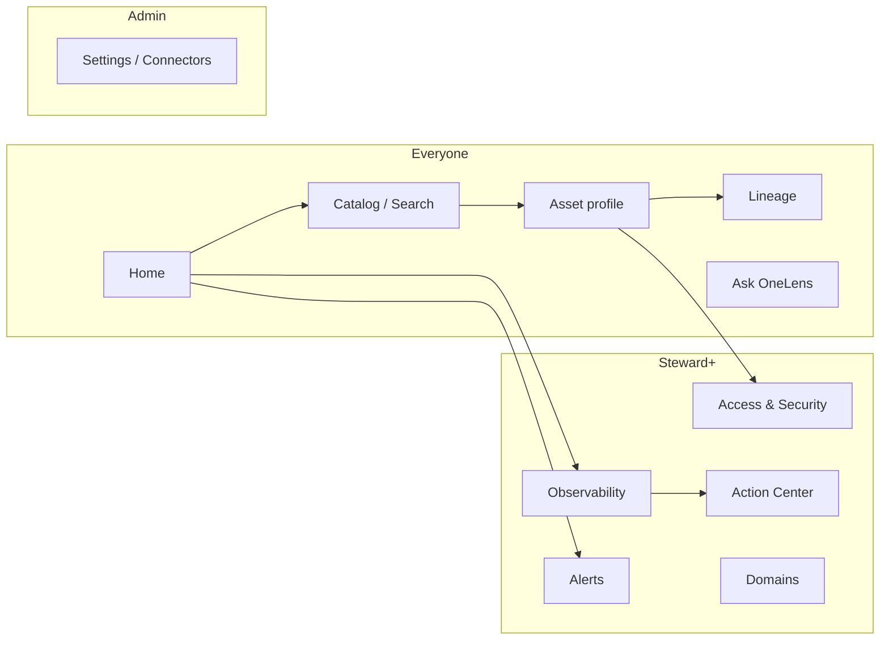
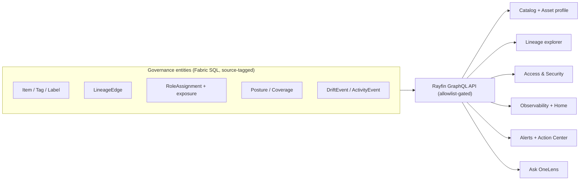
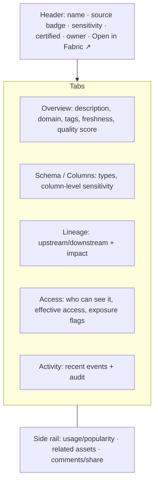

# Frontend Design & UX

> How Governance OneLens (built on [Rayfin / Fabric Apps](06-rayfin-architecture.md)) should
> look and feel. We borrow the patterns from the tools that are **killing data governance
> today** and wire every screen back to our entities, the [four-lens model](05-governance-observability.md),
> and the [API surface](07-api-surface.md).

## North star

**Make governance feel like a great product, not a compliance chore.** The best tools win
on **fast discovery, trustworthy signals, and one-click clarity** — you find the right data,
see if you can trust it, and understand who can access it, in seconds.

## Who we learn from (and what we borrow)

| Tool | What they nail | How OneLens adopts it |
| --- | --- | --- |
| **Atlan** | Google-fast search, delightful asset profiles, embedded collaboration | Universal search + rich profile page + comments/Teams share |
| **Alation** | Trust flags, popularity/behavioral signals, stewardship | Certified/endorsed badges, usage signals, steward workflows |
| **Collibra** | Governance operating model, policy & glossary, workflows | RACI-driven Action Center, baselines/policies as config |
| **Databricks Unity Catalog** | Unified catalog + lineage + permissions in one place | Cross-source catalog, column-level lineage, access tab |
| **Microsoft Purview** | Data estate insights, **recommended actions**, data products | Posture scorecards + "recommended actions" + Domains |
| **Monte Carlo** | Health dashboards, incident feed, drift/anomaly alerts | Observability board + drift/exposure alert inbox |
| **Immuta** | Attribute-based access, access monitoring | Effective-access explorer + oversharing findings |
| **Secoda / Select Star** | Lightweight, AI-assisted docs & Q&A | "Ask OneLens" copilot (MCP), auto-summaries |
| **Informatica (CDGC)** | Enterprise catalog + end-to-end lineage + glossary | Cross-platform lineage & glossary ingested via a connector |

## UX principles (ease of use)

1. **Search-first** — a single universal search bar is the front door.
2. **One page, full story** — an asset profile answers *what/whose/trusted?/who-can-see-it?* without leaving.
3. **Progressive disclosure** — summaries up front, detail on demand.
4. **Trust at a glance** — badges and scores (certified, sensitivity, quality, freshness).
5. **Role-aware** — Viewer / Steward / Admin see tailored navigation and actions.
6. **Deep-link, don't rebuild** — jump to the native OneLake catalog / Fabric item for edits.
7. **Act in context** — every finding has a next action (assign, label, alert, fix).
8. **Cross-source native** — a `source` badge (Fabric, Databricks, Purview…) everywhere.
9. **Capability-aware** — screens render only what a source supports (e.g., a Lineage tab hides when a source lacks lineage).

## Information architecture (role-aware navigation)

## Screens (mapped to the backend)

| Screen | Purpose | Backed by (entities / APIs) | Inspired by |
| --- | --- | --- | --- |
| **Home / Overview** | Governance health at a glance; personalized by role & domain; top recommended actions | `PostureSnapshot`, `CoverageMetric`, `DriftEvent` | Purview, Monte Carlo |
| **Catalog / Search** | Universal, cross-source discovery with rich filters | `Item`, `Tag`, `SensitivityLabel`, `Domain`, Catalog Search | Atlan, Secoda |
| **Asset profile** | One page: overview, schema/columns, sensitivity, certification, owner, tabs for lineage/access/quality/activity | `Item`, `RoleAssignment`, `LineageEdge`, `CoverageMetric`, `ActivityEvent` | Alation, Unity Catalog |
| **Lineage explorer** | Interactive upstream/downstream + column-level + impact analysis | `LineageEdge` | Unity Catalog, Atlan |
| **Observability** | Four-lens scorecards per layer (tenant→data); coverage trends; drift timeline | `PostureSnapshot`, `CoverageMetric`, `ActivityEvent`, `DriftEvent` | Monte Carlo, Purview |
| **Access & Security** | Effective-access explorer (who can *really* see what) + oversharing/exposure findings | `RoleAssignment`, exposure signals (publish-to-web, org-wide, external shares) | Immuta, Unity Catalog |
| **Action Center** | Steward task queue + recommended actions + RACI status | `DriftEvent`, coverage gaps, `Baseline` | Collibra, Purview |
| **Alerts / Incidents** | Drift + exposure alert inbox with routing | `DriftEvent` | Monte Carlo |
| **Domains** | Domain / data-product landing pages | `Domain`, `Item` | Purview, data mesh |
| **Ask OneLens** | Natural-language governance Q&A | Rayfin **MCP** + GraphQL | Secoda AI |
| **Settings / Connectors** | Scope, baselines/thresholds, and **adding sources** (register a connector as config — no redeploy); shows each connector's declared **capabilities** & health | `ScopeConfig`, `Baseline`, `Threshold`, `Connector` | Collibra, OpenMetadata |
| **App health** (Admin) | Scan status, freshness, last run, connector health | `Connector`, scan run metadata | Monte Carlo |

## Backend → frontend at a glance

## Sample layout — Asset profile

## Design system & tech

- **Stack** — React + Vite + Tailwind (matches the `awesome-rayfin` templates); typed
  **GraphQL** via `RayfinClient`; **Fabric SSO** gated by a fail-closed governance-reader allowlist.
- **Embed** — ship as a standalone app *and* embedded inside Fabric via
  `@microsoft/fabric-embedded-host`.
- **Components** — score rings (posture), coverage bars, trust badges, sensitivity chips,
  source badges, lineage graph, timeline/feed, action cards, data tables with saved views.
- **Accessibility & consistency** — one component library, keyboard-first search, dark mode.

## Phased UI rollout (aligned to the [backlog](06-rayfin-architecture.md#build-order-backlog))

| Phase | UI delivered |
| --- | --- |
| **1 — Discovery MVP** | Home shell, Catalog/Search, Asset profile (overview), deep-links |
| **2 — Observability** | Observability scorecards, Lineage explorer, Alerts inbox |
| **3 — Package** | Access & Security, Action Center, Domains, **Settings/Connectors**, embedded-in-Fabric |
| **4 — Intelligence** | Ask OneLens (MCP), cross-source (Databricks) badges, quality tab |
| **5 — Operate** | App-health view (scan status, freshness, connector health) |

---

*See also: [05 - Governance Observability](05-governance-observability.md) (the model behind
the scorecards) and [06 - Reference Architecture](06-rayfin-architecture.md) (the
backend that serves these screens).*
