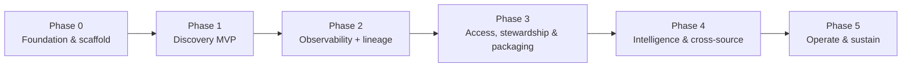

# Phased Delivery Plan

> An iterative, phase-by-phase plan to build Governance OneLens on
> [Rayfin / Fabric Apps](06-rayfin-architecture.md). Each phase is a **vertical slice** that
> ships a demoable outcome and stays deployable. Backend, frontend, and connectors move
> together so value lands every phase.

## How we iterate

- **Vertical slices** — each phase delivers scan → entity → GraphQL → screen, end to end.
- **Always deployable** — `npx rayfin up` produces a working app at the end of every phase.
- **Short iterations** — break each phase into 1–2 week increments; demo at the end.
- **Definition of done (per phase):** deployed · access-gated (governance-reader allowlist) ·
  documented · a working demo path.

## Overview

| Phase | Goal | Demoable outcome |
| --- | --- | --- |
| **0** | Deployable skeleton + scan identity | Blank authenticated app; one entity round-trips |
| **1** | Find & understand any Fabric item | Search + asset profile with deep-links |
| **2** | See posture & lineage; alert on drift | Four-lens scorecards, lineage explorer, alerts |
| **3** | Who can see what + act + easy install | Access explorer, Action Center, one-command install |
| **4** | AI Q&A + more sources + quality | Ask OneLens, Databricks + Informatica connectors, quality signals |
| **5** | Keep it reliable & current | Scan SLAs, migrations, cost/scale, connector upkeep |

> **Status (2026-07).** The **pluggable-connector foundation** — the `Connector` registry entity + the
> in-app **Connectors gallery** — was pulled forward and is **shipped**: a source registers as a
> `Connector` row and appears in-app (Fabric live; Purview/Informatica/Security as drop-ins). Phase 1
> (discovery) and Phase 2 (observability + lineage + coverage/posture + trend history) are deployed and
> passed the exit gate; drift alerts + activity ingest are the Phase-2 tail. See
> [11 - Rayfin feedback](11-rayfin-feedback.md) for platform limitations hit (notably Rayfin Functions).

## Skills architecture — per-phase skill map

Each phase **adds skills** to the Phase 0 host (see
[06 - Skills architecture](06-rayfin-architecture.md#skills-architecture)). `collection` skills
(run by the Scheduler) emit canonical entities; `analysis` skills (run by the "Ask OneLens" MCP
agent) answer over them, gated by the same governance-reader allowlist. Nothing is a prerequisite for the next thing except
the framework itself (Phase 0).

| Phase | Collection skills (Scheduler) | Analysis skills (MCP agent) |
| --- | --- | --- |
| **0** | *platform*: `entity-model`, `upsert-runner`, `skill-registry`, `mcp-host`, `auth-broker` | — |
| **1** | `fabric-inventory` (items/workspaces/domains) | `catalog-search`, `asset-profile` |
| **2** | `lineage-capture`, `activity-ingest` *(optional real-time via Eventstream→KQL)* | `four-lens-scorecard`, `drift-detect` |
| **3** | `role-assignments` | `effective-access` (aspirational tiering, not yet built — see caveat below), `oversharing-findings`, `action-center` |
| **4** | `databricks-uc`, `purview-datamap`, `informatica-cdgc`, `quality-signals` | `ask-onelens` (NL Q&A) |
| **5** | `schema-migrate`, `connector-upkeep` | `scan-health`, `cost-scale-advisor` |

Every new source is just another `collection` skill — additive, no schema/app change. The
collection **engine** (Notebook / Pipeline / UDF / KQL / Spark) lives inside each skill and is
chosen per need. *Today the Fabric connector runs on a **Spark Job Definition**; Rayfin
**Functions** (Fabric User Data Functions) is the intended serverless engine but is blocked —
see [11 - Rayfin feedback](11-rayfin-feedback.md). The connector abstraction lets us swap the
engine later without touching connectors or schema.*

---

## Phase 0 — Foundation & scaffold

**Goal:** a deployable OneLens app skeleton, the scan identity, and the first entities.

- **Entry:** Fabric capacity available; tenant admin willing to enable the Fabric Apps workload and grant the SP admin read scopes.
- **Backend** — scaffold from an `awesome-rayfin` template; define initial entities
  (`Item`, `Workspace`, `Domain`, `RoleAssignment`) with a `source` field, gated by the
  governance-reader allowlist policy; **spike the scanner → Fabric SQL write path** (GraphQL mutation vs User Data
  Function vs direct SQL) and lock it.
- **Frontend** — app shell, **Fabric SSO** login, empty Home.
- **Ops** — provision the **scan service principal** and grant its read scopes: **Fabric
  Administrator / `Tenant.Read.All`** + enable the *"service principals can call admin APIs"*
  tenant setting, plus **Azure Reader** and **Microsoft Graph** scopes (required for
  tenant-wide auto-discovery); assign **Fabric capacity** and enable the **Fabric Apps** workload.
- **Skills** — `entra-app-registration`, `azure-rbac`, `spark-authoring`.
- **Exit criteria:** `npx rayfin up` deploys; SSO works; **one entity round-trips** (scan
  writes → GraphQL reads → UI renders); the SP can call a **tenant admin/scanner API
  (auto-discovery verified)**; write path decided.
- **KPI:** app deploys in a single `rayfin up`; SP validated against ≥1 admin API.

## Phase 1 — Discovery MVP

**Goal:** find and understand any Fabric item.

- **Entry:** Phase 0 exit met (write path locked, SP admin scopes verified).
- **Backend** — **Fabric connector v1**: scanner pulls item metadata via Scanner API /
  Catalog Search → `Item`, `Tag`, `SensitivityLabel`, `Domain`; scheduled pipeline.
- **Frontend** — **Catalog / Search** (filters: domain, type, source, label, endorsement,
  owner); **Asset profile — Overview** (description, owner, sensitivity, endorsement, tags,
  domain) with **"Open in Fabric" deep-link**.
- **Skills** — `spark-authoring`, `search-consumption`.
- **Exit criteria:** cross-workspace search returns results for any allowlisted reader; profile shows
  enriched metadata; nightly + `modifiedWorkspaces` incremental scan runs.
- **KPI:** median **time-to-asset < 30s** for top searches; ≥ 90% of in-scope items indexed.

## Phase 2 — Governance observability + lineage

**Goal:** see governance posture and lineage; get alerted on drift.

- **Entry:** Phase 1 entities populated (`Item`, `Domain`, `RoleAssignment`).
- **Backend** — scanners for posture/coverage/activity per layer → `PostureSnapshot`,
  `CoverageMetric`, `ActivityEvent`; **lineage capture** → `LineageEdge` (+ completeness %);
  **drift detection** → `DriftEvent`; network/Azure Policy posture pull.
- **Frontend** — **Observability** (four-lens scorecards per layer, coverage trends, drift
  timeline); **Lineage explorer** (upstream/downstream + impact); Asset profile **Lineage**
  and **Activity** tabs; **Alerts inbox**.
- **Skills** — `spark-authoring`, `activator-authoring`, `azure-kusto`.
- **Exit criteria:** posture/coverage % per layer render; lineage completeness % shown; a
  **drift alert fires end-to-end**; works under **Private Link** (signals from APIs).
- **KPI:** **≥ 95%** of in-scope items labeled (coverage); lineage completeness **≥ 80%**; drift **MTTA** measured.

## Phase 3 — Access, stewardship & packaging

**Goal:** answer "who can *really* see what," act on findings, and install easily.

> **Caveat (added after Phase 0-2 delivery):** the sections below describe an aspirational
> **Admin/Steward/Viewer** access-tiering model. The access model actually shipped in Phase 0
> is a flat, fail-closed **governance-reader allowlist** (see
> [ARCHITECTURE.md § Security & Governance](../ARCHITECTURE.md#security--governance)) — every
> allowlisted reader sees the whole tenant catalog, with no per-row/per-tier trimming. Building
> real tiered access would be new work, not something Rayfin's `@authenticated` decorator does
> out of the box; re-scope this phase's "role audiences" item accordingly before starting it.

- **Entry:** Phase 2 posture/coverage + role data flowing.
- **Backend** — **effective access** (Graph group transitive expansion + PIM/privileged
  roles); **oversharing/exposure** (publish-to-web, org-wide links, external data shares);
  `Connection`/`PrivateEndpoint`; `Baseline`/`Threshold`/`ScopeConfig` as config;
  **recommended-action** generation.
- **Frontend** — **Access & Security** explorer; **Action Center** (task queue, recommended
  actions, RACI status); **Domains** landing; **embed inside Fabric** (`fabric-embedded-host`);
  role audiences (Admin/Steward/Viewer).
- **Skills** — `azure-rbac`, `activator-authoring`.
- **Exit criteria:** effective access resolves group/PIM; exposure findings listed **with a
  next action**; stewards action drift from the Action Center; app installs via
  `npx rayfin up` and embeds; **install runbook + `awesome-rayfin` template** published.
- **KPI:** **100%** of oversharing findings have an owner + action; effective access resolves group/PIM for ≥ 95% of assignments.

## Phase 4 — Intelligence & cross-source

**Goal:** natural-language Q&A, more data sources, and quality.

- **Entry:** Phase 3 shipped; MCP tooling + Databricks (Unity Catalog) access available.
- **Backend** — **Rayfin MCP** over the entities (trimmed); **cross-platform connectors**
  (**Databricks** via Unity Catalog, then **Informatica** via IDMC/CDGC → shared entities);
  **quality/freshness** (Purview Data Quality, refresh/job history); **compliance overlay** mappings;
  a versioned **NL-Q&A evaluation set** (golden questions → expected answers) that backs the Q&A KPI.
- **Frontend** — **Ask OneLens** chat; `source` badges/filters everywhere; **Quality** tab;
  **compliance report** views.
- **Exit criteria:** NL questions answered for any allowlisted reader; **Databricks (and Informatica)
  assets appear alongside Fabric** in search/lineage; quality scores shown; at least one
  compliance overlay (e.g., ISO/FedRAMP) view exists.
- **KPI:** ≥ 1 non-Fabric source (Databricks/Informatica) live; NL Q&A answers ≥ 80% of a test set correctly.

## Phase 5 — Operate & sustain

**Goal:** keep the governance data reliable, current, and cost-aware.

- **Entry:** Phase 4 in production with real users.
- **Backend** — scan **reliability** (retries, alert on failed scans, freshness SLAs);
  **schema migration** discipline (`rayfin up db apply` with versioned entity changes);
  **capacity/cost** monitoring of scans + app; connector **upkeep** as source APIs evolve.
- **Frontend** — an **app-health** view (scan status, freshness, last run) for admins.
- **Skills** — `spark-operations`, `sqldw-operations`, `activator-authoring`.
- **Exit criteria:** scan **success rate ≥ 99%**; data freshness within SLA; capacity within
  budget; a documented **upgrade / migration** runbook.
- **KPI:** scan success ≥ 99%; median data-freshness within target; zero unplanned schema breaks.

---

## Cross-cutting workstreams (every phase)

| Workstream | Ongoing responsibility |
| --- | --- |
| **Security & privacy** | Least-privilege SP, governance-reader allowlist policy, keep secrets out of public static content |
| **Design system** | Shared components (score rings, badges, timelines), accessibility, dark mode |
| **Testing** | Connector unit tests, GraphQL contract tests, allowlist-policy access tests |
| **Docs & templates** | Keep the knowledge base current; publish the app as an OSS template |
| **Observability of the app** | Scan run monitoring, failures, freshness of the governance data itself |

## Risks & decisions to close early

| Risk / decision | Sev | Likelihood | Owner | Trigger / mitigation |
| --- | --- | --- | --- | --- |
| **Scanner → Fabric SQL write path** — **LOCKED: direct-SQL bulk `MERGE`** | High | — | Eng lead | Resolved in Phase 0 — idempotent upsert on canonical `id` behind a swappable `upsert()` helper; app writes via GraphQL; the governance-reader allowlist policy trims at read time |
| **Tenant-admin consent** for the SP refused | High | Med | Platform owner | Fall back to scoped membership; narrow via `ScopeConfig`; document the least-privilege ask |
| **Fabric Apps is preview** (region / GA) | Med | Med | Eng lead | Confirm region + capacity; contingency = defer prod, run in a supported region |
| **Public static-URL exposure** | Med | Low | Security | Keep secrets out of frontend/code; rely on Fabric SSO + the governance-reader allowlist; review what the app renders |
| **API throttling (429)** at scale | Med | Med | Eng | Batch scanner calls, back off, checkpoint cursors, prefer incremental scans |
| **Databricks cross-cloud auth** (Unity Catalog) | Med | Med | Eng | Separate least-privilege credential per connector; verify UC API access early |
| **Preview/GA dependencies** (OneLake security, Catalog Search, Data Agent) | Low | Med | Eng | Feature-flag; degrade gracefully if unavailable |

---

*See also: [06 - Reference Architecture](06-rayfin-architecture.md#build-order-backlog)
(backend backlog) and [08 - Frontend Design & UX](08-frontend-design.md) (screen rollout).*
