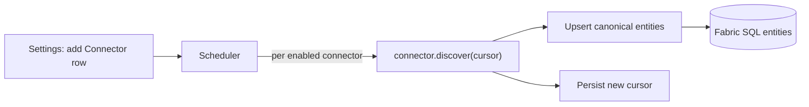

# Connector SDK Spec

> The precise contract every source connector implements. A connector maps an external
> platform's governance metadata into the **canonical entities**, so a new source is a
> **drop-in package + one config row** — no app or schema change
> (see [06 - Architecture](06-rayfin-architecture.md#open-source--extensibility)).

## Design goals

- **Zero reconfiguration** — canonical, `source`-tagged model; the app/UI are data-driven.
- **Idempotent** — every entity has a stable canonical `id`; runs upsert, never duplicate.
- **Incremental** — connectors checkpoint a cursor; only changes are re-emitted.
- **Standards-aligned** — lineage ≈ **OpenLineage**, assets ≈ **W3C DCAT**, model ≈ **ISO/IEC 11179**.
- **Capability-negotiated** — a connector declares what it supports; the app adapts.

## Canonical entities

Shared primitives every connector emits. All extend `BaseEntity`.

```typescript
type EntityKind =
  | "Item" | "Workspace" | "Domain" | "RoleAssignment"
  | "LineageEdge" | "ActivityEvent" | "PostureSignal" | "Connection";

interface BaseEntity {
  kind: EntityKind;
  source: string;      // connector id, e.g. "databricks"
  sourceId: string;    // native id in the source system
  id: string;          // canonical id = `${source}:${kind}:${sourceId}`
  name?: string;
  observedAt: string;  // ISO timestamp of the scan
  deleted?: boolean;   // tombstone for removed objects
}

interface Principal { type: "user" | "group" | "servicePrincipal"; id: string; name?: string; }
interface Column { name: string; dataType?: string; classifications?: string[]; sensitivity?: string; }

interface ItemEntity extends BaseEntity {
  kind: "Item";
  type: string;              // table | view | report | model | notebook | dashboard …
  qualifiedName: string;     // e.g. catalog.schema.table
  containerRef?: string;     // canonical id of Workspace/Domain
  owner?: Principal;
  description?: string;
  sensitivity?: string;      // label name
  classifications?: string[];// PII, PCI …
  endorsement?: "none" | "promoted" | "certified";
  tags?: string[];
  columns?: Column[];
  freshnessAt?: string;
  deepLink?: string;         // URL back to the native item
}

interface RoleAssignmentEntity extends BaseEntity {
  kind: "RoleAssignment";
  principal: Principal;
  role: string;              // Admin | Read | Owner | Write …
  scopeRef: string;          // canonical id of the Item/Workspace/Domain
  grantType: "direct" | "group" | "inherited";
  effective?: boolean;       // true once group/PIM-expanded
}

interface LineageEdgeEntity extends BaseEntity {
  kind: "LineageEdge";
  fromRef: string;           // upstream canonical Item id
  toRef: string;             // downstream canonical Item id
  columnLevel?: { from: string; to: string }[];
  process?: string;          // job/notebook/pipeline that produced it
}

interface ActivityEventEntity extends BaseEntity {
  kind: "ActivityEvent";
  actor: Principal;
  action: string;            // read | share | publishToWeb | roleChange …
  targetRef?: string;
  at: string;
}

interface PostureSignalEntity extends BaseEntity {
  kind: "PostureSignal";
  layer: "tenant" | "network" | "capacity" | "workspace" | "item" | "data";
  control: string;           // publicAccessDisabled | labeled | privateLink …
  status: "pass" | "fail" | "unknown";
  detail?: Record<string, unknown>;
}

type CanonicalEntity =
  | ItemEntity | RoleAssignmentEntity | LineageEdgeEntity
  | ActivityEventEntity | PostureSignalEntity | BaseEntity;
```

> `PostureSnapshot`, `CoverageMetric`, and `DriftEvent` are **derived by the app** from these
> raw signals — connectors don't compute them, keeping connectors simple.

## Capabilities

```typescript
type Capability =
  | "items" | "workspaces" | "domains" | "roles"
  | "lineage" | "columnLineage" | "classifications"
  | "activity" | "posture" | "incremental";
```

The UI renders only what a source declares (e.g., hides a Lineage tab if the source lacks
`lineage`). New capabilities degrade gracefully.

## The connector interface

```typescript
interface GovernanceConnector {
  id: string;                 // "databricks"
  source: string;             // stamped on every entity
  version: string;
  capabilities: Capability[];
  authenticate(config: ConnectorConfig): Promise<Session>;
  discover(session: Session, ctx: DiscoverContext): AsyncIterable<Emission>;
  healthCheck?(session: Session): Promise<{ ok: boolean; message?: string }>;
}

interface ConnectorConfig {
  source: string;
  endpoint?: string;
  credentialRef: string;      // Key Vault / Fabric connection reference — NEVER a raw secret
  scope?: Record<string, unknown>; // e.g. { catalogs: ["main"] }
  schedule?: string;          // cron
}

interface DiscoverContext {
  cursor?: string;            // opaque incremental cursor from the last run
  full?: boolean;             // force a full scan
  signal?: AbortSignal;       // cancellation / timeout
}

interface Checkpoint { kind: "Checkpoint"; source: string; cursor: string; }
type Emission = CanonicalEntity | Checkpoint;
```

## Skills model (collection + analysis)

`GovernanceConnector` is the **`collection`** kind of a broader **`GovernanceSkill`** — the
unit OneLens is built from (see [06 - Skills architecture](06-rayfin-architecture.md#skills-architecture)).
A skill adds a `kind` and a `description` (its trigger) to the same self-registering,
capability-negotiated contract, so both kinds register as data (a config row) and are invoked
by description — the **Scheduler** runs `collection` skills, the **"Ask OneLens" MCP agent** runs
`analysis` skills.

```typescript
type SkillKind = "platform" | "collection" | "analysis";

interface GovernanceSkill {
  id: string;
  kind: SkillKind;
  description: string;          // when this skill runs / when the agent selects it
  capabilities: Capability[];
}

// collection = a connector (the rest of this spec): authenticate() + discover() → AsyncIterable<Emission>
interface CollectionSkill extends GovernanceSkill, GovernanceConnector { kind: "collection"; }

// analysis = a grounded governance answer over the canonical entities, gated by the governance-reader allowlist
interface AnalysisSkill extends GovernanceSkill {
  kind: "analysis";
  answer(query: string, ctx: DiscoverContext): Promise<GroundedResult>; // reads via the GraphQL API
}
```

> The collection **engine** (Notebook / Pipeline / UDF / KQL / Spark) is an implementation
> detail *inside* a `collection` skill — callers only see canonical entities. Swap the engine
> without touching connectors or schema.

## Incremental & cursor contract

1. The runner passes `ctx.cursor` (from the last successful run) into `discover`.
2. The connector emits only entities changed since that cursor (or all, if `full`).
3. The connector emits a terminal `Checkpoint { cursor }`; the runner persists it to the
   `Connector` config row.
4. On failure before a `Checkpoint`, the cursor is unchanged — the next run safely retries.
5. Removals are emitted as tombstones (`deleted: true`) or reconciled by a periodic full scan.

## Upsert & registration

- **Upsert** — the runner writes each entity by canonical `id` (idempotent). Access is gated at
  read time by the governance-reader allowlist policy; the scan writes as the service principal.
- **Registration is data, not code** — a `Connector` row holds
  `{ id, source, enabled, endpoint, credentialRef, scope, schedule, cursor, capabilities, lastRunAt, status }`.
  The scheduler enumerates **enabled** rows and runs the matching connector package.
  **Adding a source = install the package + insert one row from Settings.** No redeploy.



## Analysis-skill registration (status must reflect reality, not aspiration)

`collection` skills self-register as a side effect of running (every scan upserts
`connector:fabric` with fresh `lastSeen`/`status`). `analysis` skills (the "Ask OneLens" MCP
agent tier) have no recurring scheduler run to piggyback on, so they need the **same
self-registering contract applied deliberately in two places** — skipping either one is how a
connector is left permanently `planned` even after it's built and working (this happened once:
`connector:onelens` shipped as a seed/roadmap row and nothing ever flipped it to `connected`):

1. **The deploy script upserts its own row on success.** Whatever script creates/publishes the
   capability (e.g. `create_data_agent.py`) writes its `Connector` row — `status: "connected"`,
   real `endpoint`/`scope` — as the last step after a successful publish. This gives immediate,
   correct status the moment the capability first goes live, without waiting on anything else.
2. **The recurring job re-verifies liveness every run**, the same auto-discovered /
   auto-removed guarantee collection connectors get for free. `sjd_governance_scan.py`'s
   `check_analysis_skills()` calls the Fabric REST API each scan to confirm the Data Agent
   still exists, and reconciles `status` accordingly (`connected` if found, `planned` if not —
   never raises, so a transient REST hiccup can't falsely flip a healthy connector). This is
   what makes "removed when deleted" true for analysis skills too, not just collection ones.

A future analysis skill should follow the identical recipe: self-register in its own
create/deploy script, and add a lightweight existence check to the nightly scan's Connectors
upsert stage. Both writes go through the same `source`-parameterized `_merge()` helper collection
connectors use — `source` just becomes the new skill's id (e.g. `"onelens"`) instead of `"fabric"`.

## Example: Databricks connector (Unity Catalog)

| Unity Catalog source | Canonical entity |
| --- | --- |
| Catalog / schema | `Domain` / `Workspace` (container) |
| Table / view / volume / function / model | `Item` (with `type`) |
| `GRANT`s (catalog/schema/table privileges) | `RoleAssignment` |
| `system.access.table_lineage` / `column_lineage` | `LineageEdge` (+ `columnLevel`) |
| UC tags | `Item.tags` |
| Column masks / row filters, classifications | `PostureSignal` / `Item.classifications` |
| `system.access.audit` | `ActivityEvent` |

- **APIs:** Unity Catalog REST (`/api/2.1/unity-catalog/{catalogs,schemas,tables}`),
  permissions (`/permissions`), and **system tables** via SQL for lineage/audit.
- **Auth:** Databricks OAuth / PAT via `credentialRef` (least-privilege, per connector).
- **Capabilities:** `["items","domains","roles","lineage","columnLineage","classifications","activity","incremental"]`.

```typescript
async function* discover(session, ctx) {
  for (const cat of await listCatalogs(session, ctx.scope)) {
    for (const tbl of await listTables(session, cat)) {
      yield toItem(tbl);                       // ItemEntity (source:"databricks")
      for (const g of await grants(session, tbl)) yield toRoleAssignment(g);
    }
  }
  for (const e of await queryLineage(session, ctx.cursor)) yield toLineageEdge(e);
  yield { kind: "Checkpoint", source: "databricks", cursor: nowCursor() };
}
```

## Example: Informatica connector (IDMC / CDGC)

Informatica exposes two useful surfaces:

- **CDGC** (Cloud Data Governance & Catalog) — the governance metadata: cataloged assets,
  business glossary, classifications, and **end-to-end cross-platform lineage**. Richest source.
- **CDI** (Cloud Data Integration) — ETL mappings/tasks that read/write OneLake; contributes
  **process lineage** (source→target) and **run activity**.

| Informatica source | Canonical entity |
| --- | --- |
| CDGC asset (table / file / report) | `Item` |
| CDGC business glossary term / domain | `Domain` / `Item.tags` |
| CDGC classifications | `Item.classifications` |
| CDGC lineage graph | `LineageEdge` (+ `process`) |
| CDI mapping / task lineage | `LineageEdge` (`process` = mapping) |
| CDI job runs | `ActivityEvent` |

- **APIs:** IDMC / **CDGC REST** (Metadata Command Center) for assets, glossary,
  classifications, and lineage; CDI job/run APIs for activity.
- **Auth:** IDMC login → session token via `credentialRef` (least-privilege catalog-read role).
- **Capabilities:** `["items","domains","classifications","lineage","activity","incremental"]`.

## Onboarding a connector (install + one row, no redeploy)

Adding **any** source is the same three steps — no code change, no app redeploy:

1. **Install** the connector package (e.g., `@rayfin/connector-databricks`).
2. **Add a `Connector` row** in **Settings → Connectors**: `id`/`source`, `endpoint`,
   `credentialRef` (Key Vault / Fabric connection — never a raw secret), `scope`, `schedule`.
3. **First scan** — the scheduler picks up the enabled row, negotiates capabilities, and
   populates entities. New `source` badges, filters, and tabs appear automatically.

### Databricks — onboarding

- **Install:** `@rayfin/connector-databricks`
- **Credential:** a Databricks **OAuth service principal** (or PAT) with **read** on Unity
  Catalog + the `system.access` schema; stored as `credentialRef`.
- **Grants:** `USE CATALOG/SCHEMA`, `SELECT` on `system.access.table_lineage` / `audit`, catalog metadata read.
- **Config row:**
  ```json
  { "id": "databricks", "source": "databricks",
    "endpoint": "https://adb-xxxx.azuredatabricks.net",
    "credentialRef": "kv://rayfin/databricks-oauth",
    "scope": { "catalogs": ["main", "prod"] }, "schedule": "0 2 * * *" }
  ```
- **Result:** Databricks tables / grants / lineage / audit land as `Item` / `RoleAssignment` /
  `LineageEdge` / `ActivityEvent`, tagged `source: "databricks"`.

### Informatica — onboarding

- **Install:** `@rayfin/connector-informatica`
- **Credential:** an IDMC user/role with **read** on the CDGC catalog + lineage (and CDI job
  read for activity); stored as `credentialRef`.
- **Config row:**
  ```json
  { "id": "informatica", "source": "informatica",
    "endpoint": "https://<pod>.informaticacloud.com",
    "credentialRef": "kv://rayfin/idmc-login",
    "scope": { "catalogs": ["Fabric OneLake"] }, "schedule": "0 3 * * *" }
  ```
- **Result:** Informatica cataloged assets + **cross-platform lineage** + glossary land as
  `Item` / `LineageEdge` / `Domain` / classifications, tagged `source: "informatica"` —
  extending lineage **beyond Fabric**.

> Both are **additive**: the shared entity model absorbs them with no schema change and no
> redeploy. Settings shows each connector's declared capabilities and last-run health.

## Conformance (connector tests)

A connector passes if it:
- Emits **valid canonical entities** with stable `id`s and a `source`.
- Is **idempotent** (re-running yields the same upserts, no dupes).
- **Honors the cursor** (incremental returns only changes; emits a `Checkpoint`).
- **Respects capabilities** (never emits what it didn't declare).
- **Never leaks secrets** (uses `credentialRef` only).

## Standards mapping

| Canonical | Open standard |
| --- | --- |
| `LineageEdge` | **OpenLineage** run/dataset events |
| `ItemEntity` | **W3C DCAT** Dataset |
| entity model | **ISO/IEC 11179** metadata registry shape |
| classifications/labels | Purview / Atlas classifications |

---

*See also: [06 - Reference Architecture](06-rayfin-architecture.md) (where connectors
run) and [07 - API Surface](07-api-surface.md) (the Fabric connector's sources).*
